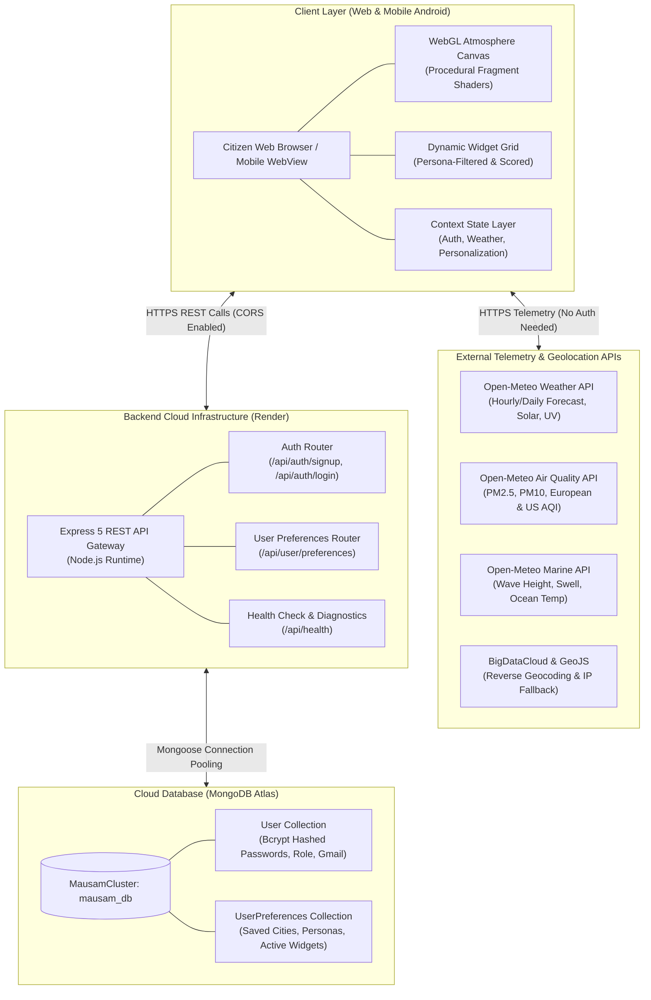
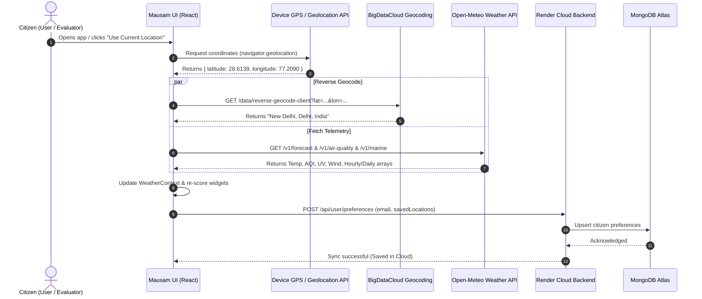

# Mausam (मौसम) — Complete Technical Architecture & System Guide

Welcome to the comprehensive technical documentation for **Mausam (मौसम)**, an intelligent, personalized weather assistant and native Android application designed to deliver citizen-centric meteorological intelligence.

This document covers the end-to-end architecture, folder structure, frontend and backend implementations, data flow lifecycles, and deployment topologies so your entire team can understand, extend, and present the system with confidence.

---

## Table of Contents

1. [Executive Summary & Problem Statement](#1-executive-summary--problem-statement)
2. [High-Level System Architecture](#2-high-level-system-architecture)
3. [Repository Directory Structure](#3-repository-directory-structure)
4. [Frontend Architecture (React 19 + Vite)](#4-frontend-architecture-react-19--vite)
   - [Core Component Hierarchy](#core-component-hierarchy)
   - [Global State Management (Context Layer)](#global-state-management-context-layer)
   - [Dynamic Persona & Widget Scoring Engine](#dynamic-persona--widget-scoring-engine)
   - [Hardware-Accelerated WebGL Atmosphere Canvas](#hardware-accelerated-webgl-atmosphere-canvas)
   - [Live Weather & Environmental Services](#live-weather--environmental-services)
   - [UI Screens & Navigation](#ui-screens--navigation)
5. [Backend Architecture (Express 5 + MongoDB Atlas)](#5-backend-architecture-express-5--mongodb-atlas)
   - [Server Entry & Middleware Pipeline](#server-entry--middleware-pipeline)
   - [Database Connection & Mongoose Schemas](#database-connection--mongoose-schemas)
   - [REST API Endpoint Catalog](#rest-api-endpoint-catalog)
   - [Security, Authentication & Validation](#security-authentication--validation)
6. [Mobile Application Architecture (Android APK / Capacitor 8)](#6-mobile-application-architecture-android-apk--capacitor-8)
   - [Native Bridge & Hardware Acceleration](#native-bridge--hardware-acceleration)
   - [Device Permissions & Geolocation Lifecycle](#device-permissions--geolocation-lifecycle)
   - [Automated Cloud Build Pipeline (GitHub Actions CI/CD)](#automated-cloud-build-pipeline-github-actions-cicd)
7. [End-to-End Data Flow Diagrams](#7-end-to-end-data-flow-diagrams)
8. [Technology Stack Reference](#8-technology-stack-reference)

---

## 1. Executive Summary & Problem Statement

### The Problem with Traditional Weather Apps
Most commercial weather applications (such as Apple Weather, Google Weather, or AccuWeather) are **generic data dashboards**. They show temperature, humidity, and barometric pressure, leaving the cognitive burden of interpretation on the citizen:
- A farmer does not just need "80% humidity"; they need to know if pesticide spraying will wash away or if soil moisture is optimal for sowing.
- An asthma or bronchitis patient does not just need "AQI 180"; they need an explicit advisory on whether outdoor morning exercise will trigger respiratory distress.
- A commuter does not just need "visibility 2 km"; they need advance warning if dense fog will paralyze the highway during peak office hours.

### The Mausam Solution
**Mausam** bridges the gap between raw atmospheric science and daily human decisions:
1. **Persona-Driven Contextualization:** Adapts widgets and advisories based on citizen identity (**Farmer, Health-Sensitive, Outdoor Athlete, Daily Commuter, Traveler**).
2. **Heuristic Scoring Engine:** Dynamically weights, sorts, and surfaces the most critical widgets based on live atmospheric severity (e.g., surfaces AQI alerts when PM2.5 crosses hazardous thresholds, or surfaces Fog advisor when dew-point depression is minimal).
3. **Immersive Atmospheric Experience:** Renders live, procedural WebGL shader skies, rainfall, snowfall, lightning, and day/night cycles synchronized with real solar elevation.
4. **Universal Accessibility:** Available both as a responsive Progressive Web Application and an installable native Android `.apk`.

---

## 2. High-Level System Architecture



---

## 3. Repository Directory Structure

```
mausam/
├── .github/
│   └── workflows/
│       └── build-apk.yml               # Automated CI/CD Android APK compiler
├── android/                            # Native Android Project (Capacitor 8)
│   ├── app/
│   │   ├── src/main/
│   │   │   ├── AndroidManifest.xml     # Permissions (GPS Fine/Coarse, Internet)
│   │   │   ├── java/com/sih/mausam/    # Native Java MainActivity entry
│   │   │   └── res/                    # App icons, splash screens, strings
│   │   └── build.gradle                # Android app-level Gradle build script
│   ├── build.gradle                    # Top-level Gradle configuration
│   └── gradlew                         # Linux/macOS Gradle wrapper
├── public/                             # Static public assets
├── server/                             # Node.js & Express 5 Backend
│   ├── models/
│   │   ├── User.js                     # Citizen user account Mongoose model
│   │   └── UserPreferences.js          # Citizen preferences & saved locations model
│   ├── routes/
│   │   ├── authRoutes.js               # Signup & login API handlers
│   │   └── userRoutes.js               # Cloud preference sync API handlers
│   ├── db.js                           # MongoDB Atlas connection manager
│   ├── server.js                       # Express app entry, middlewares, health check
│   └── backendPlugin.js                # Vite integration helper
├── src/                                # React 19 Frontend Codebase
│   ├── assets/                         # SVG icons, logo, graphic assets
│   ├── components/
│   │   ├── common/                     # Shared UI components
│   │   │   ├── AlertBanner.jsx         # Severity alert notification bar
│   │   │   ├── BottomNav.jsx           # Mobile navigation bar (Home, Explore, Alerts, Profile)
│   │   │   ├── Header.jsx              # App bar, location title, live time, search toggle
│   │   │   ├── LifestyleInterestsModal.jsx # Persona multi-selector modal
│   │   │   └── ModalSheet.jsx          # Reusable slide-up bottom drawer
│   │   ├── demo/
│   │   │   └── JuryDemoSwitcher.jsx    # Jury presentation scenario switcher
│   │   ├── hero/                       # Atmospheric Hero section
│   │   │   ├── AtmosphericHero.jsx     # Primary weather card (Temp, condition, high/low)
│   │   │   ├── ForecastSection.jsx     # 24-hour hourly and 7-day forecast cards
│   │   │   ├── HourlyScrubber.jsx      # Interactive timeline slider
│   │   │   └── WeatherAtmosphereCanvas.jsx # WebGL fragment shader simulation
│   │   ├── onboarding/
│   │   │   └── OnboardingModal.jsx     # 3-step live GPS & lifestyle onboarding wizard
│   │   └── widgets/                    # Persona-specific smart widgets
│   │       ├── AddWidgetModal.jsx      # Widget catalog browser & adder
│   │       ├── BeachTidesWidget.jsx    # Marine, wave height & water temp widget
│   │       ├── CommuterFogWidget.jsx   # Visibility, fog warning & transit advisor
│   │       ├── EventForecastWidget.jsx # Outdoor planner & event weather predictor
│   │       ├── FamilyCommuteWidget.jsx # School/work commute safety advisor
│   │       ├── FarmingAgroWidget.jsx   # Soil moisture, spray advisor, agro risk
│   │       ├── FitnessRunningWidget.jsx# Runner thermal comfort & workout windows
│   │       ├── HealthAqiWidget.jsx     # Air quality index, PM2.5, PM10 & asthma advisory
│   │       ├── TravelPackingWidget.jsx # Luggage packing & weather gear advisor
│   │       ├── UniversalWidgets.jsx    # Wind, UV, Humidity, Pressure, Sunrise/Sunset
│   │       ├── WidgetHeaderActions.jsx # Widget pin, remove & reorder controls
│   │       ├── WidgetModalSheet.jsx    # Expanded widget detail inspector
│   │       └── WidgetRegistry.jsx      # Master registry mapping IDs to components
│   ├── config/
│   │   └── api.js                      # Centralized API base URL resolver
│   ├── context/
│   │   ├── AuthContext.jsx             # User authentication, JWT, guest session state
│   │   ├── PersonalizationContext.jsx  # Persona selections, widget layout & Atlas sync
│   │   └── WeatherContext.jsx          # Live GPS, reverse geocoding, multi-city state
│   ├── data/
│   │   ├── mockWeatherData.js          # Offline fallback mock data
│   │   └── personaProfiles.js          # Metadata for 5 citizen persona definitions
│   ├── screens/                        # Primary application views
│   │   ├── AlertsScreen.jsx            # Critical weather alerts & emergency warnings
│   │   ├── AuthScreen.jsx              # Citizen login & registration screen
│   │   ├── ExploreScreen.jsx           # Global city weather explorer & search
│   │   ├── HomeScreen.jsx              # Main personalized intelligence dashboard
│   │   ├── ProfileScreen.jsx           # User settings, units, active personas, account
│   │   ├── SavedLocationsScreen.jsx    # Multi-location bookmark manager
│   │   └── WelcomeScreen.jsx           # Landing screen for first-time visitors
│   ├── services/
│   │   └── liveWeatherService.js       # Live Open-Meteo, Air Quality & Marine client
│   ├── utils/
│   │   ├── weatherThemes.js            # Color tokens, glass tints, icon resolvers
│   │   └── widgetScoringEngine.js      # Heuristic algorithm ranking widget priority
│   ├── App.jsx                         # Main layout, screen routing, modal managers
│   ├── index.css                       # Tailwind CSS directives & cyan glass tokens
│   └── main.jsx                        # React 19 root mounting point
├── capacitor.config.json               # Capacitor mobile container configuration
├── package.json                        # Monorepo dependencies and build scripts
└── vite.config.js                      # Vite bundler, React plugin, dev proxy
```

---

## 4. Frontend Architecture (React 19 + Vite)

The frontend is engineered with **React 19**, **Vite**, and **Tailwind CSS**. It follows a modular, unidirectional data-flow architecture.

### Core Component Hierarchy

```
App.jsx (Root Component)
 ├── AuthProvider
 │    └── WeatherProvider
 │         └── PersonalizationProvider
 │              ├── WeatherAtmosphereCanvas (WebGL Background)
 │              ├── Header (Location Selector, Live Clock, Global Search)
 │              ├── Main Viewport (Screen Switcher)
 │              │    ├── HomeScreen (Default)
 │              │    │    ├── AlertBanner (Active Emergency Warnings)
 │              │    │    ├── AtmosphericHero (Live Temp, Condition, Range)
 │              │    │    ├── ForecastSection (Hourly & Weekly Carousels)
 │              │    │    └── Dynamic Widget Grid (Personalized & Reorderable)
 │              │    │         ├── HealthAqiWidget
 │              │    │         ├── FarmingAgroWidget
 │              │    │         ├── FitnessRunningWidget
 │              │    │         ├── CommuterFogWidget
 │              │    │         ├── TravelPackingWidget
 │              │    │         └── UniversalWidgets (Wind, UV, Marine)
 │              │    ├── ExploreScreen (Search & Discover Global Cities)
 │              │    ├── AlertsScreen (Disaster & Weather Warnings)
 │              │    ├── SavedLocationsScreen (City Bookmarks)
 │              │    └── ProfileScreen (Citizen Account & Persona Config)
 │              ├── BottomNav (Fixed Mobile Navigation Bar)
 │              ├── OnboardingModal (3-step GPS & Persona Wizard)
 │              ├── JuryDemoSwitcher (Floating Evaluation Toolbar)
 │              └── WidgetModalSheet (Slide-up Detailed Widget Inspector)
```

---

### Global State Management (Context Layer)

The application utilizes three specialized React Contexts that maintain synchronized state between client memory, `localStorage`, and the remote MongoDB Atlas database:

#### 1. `AuthContext.jsx`
- **Purpose:** Manages citizen authentication lifecycle.
- **Key State:** `user` (`{ name, email, role, isGuest }`), `authView` (`'welcome' | 'login' | 'signup'`), `shouldOpenOnboarding`.
- **Capabilities:**
  - Strict Gmail format validation (`/^[a-zA-Z0-9]+([._%+-][a-zA-Z0-9]+)*@gmail\.com$/`).
  - Seamless Guest Mode allowing instant evaluation without mandatory sign-up.
  - Automatic persistence to `localStorage` key `mausam_auth_user_v2`.
  - Dispatches HTTP requests to `${API_BASE_URL}/api/auth/login` and `/api/auth/signup`.

#### 2. `WeatherContext.jsx`
- **Purpose:** Handles atmospheric telemetry, location tracking, and multi-city management.
- **Key State:** `activeLocationId`, `currentWeather` (real-time telemetry payload), `realLocations` (array of citizen bookmarked cities), `isLocating` (GPS loading state).
- **Capabilities:**
  - **Live GPS Resolution:** Interacts with HTML5 Geolocation API (`navigator.geolocation.getCurrentPosition`) with fallback to IP-based coordinates.
  - **Reverse Geocoding:** Translates raw latitude/longitude into human-readable city, state, and country names.
  - **Multi-City Cloud Sync:** Automatically debounces and syncs the citizen's saved locations list to MongoDB Atlas on change.

#### 3. `PersonalizationContext.jsx`
- **Purpose:** Controls dashboard customization, active citizen personas, and widget layouts.
- **Key State:** `activePersonas` (e.g. `['health', 'farming']`), `answers` (questionnaire answers), `pinnedWidgetIds`, `removedWidgetIds`, `customAddedWidgetIds`, `unit` (`'celsius' | 'fahrenheit'`).
- **Capabilities:**
  - Implements **Pinning**, **Removing**, and **Adding** widgets.
  - Persists preference changes to MongoDB Atlas via `${API_BASE_URL}/api/user/preferences`.
  - Re-evaluates widget arrangement using the scoring engine whenever weather or persona state changes.

---

### Dynamic Persona & Widget Scoring Engine

Located in [`src/utils/widgetScoringEngine.js`](file:///c:/Users/ROSHAN%20KUMAR/OneDrive/Desktop/mausam/src/utils/widgetScoringEngine.js), this engine is one of the project's core differentiators.

Instead of displaying a static dashboard, it computes an **urgency and relevance score** for every widget based on:
1. **Active Personas:** If a user selects "Farming", agricultural widgets receive a high base weight (+50).
2. **Atmospheric Triggers:**
   - **AQI Spike:** If PM2.5 > 60 µg/m³ or AQI > 150, the `HealthAqiWidget` gains emergency priority (+100).
   - **Severe Weather Alert:** If wind speed > 40 km/h or thunderstorm code (WMO 95-99) is detected, disaster warnings jump to position #1.
   - **Morning Commute Window:** If local time is between 06:00 and 09:30 AM and humidity > 90% (fog risk), `CommuterFogWidget` is elevated.
   - **Farming Spray Window:** If rain probability < 20% and wind < 15 km/h, the `FarmingAgroWidget` highlights an "Optimal Spraying Window".
3. **User Overrides:** Pinned widgets (`pinnedWidgetIds`) are automatically placed at the top of the grid regardless of algorithm ranking.

---

### Hardware-Accelerated WebGL Atmosphere Canvas

Located in [`src/components/hero/WeatherAtmosphereCanvas.jsx`](file:///c:/Users/ROSHAN%20KUMAR/OneDrive/Desktop/mausam/src/components/hero/WeatherAtmosphereCanvas.jsx):
- **Implementation:** Custom WebGL 1.0/2.0 context running specialized GLSL fragment shaders on the GPU.
- **Zero Overhead:** Renders on an off-screen `<canvas>` with `willReadFrequently: false`, achieving a consistent 60 FPS on mobile and low-power laptops.
- **Atmospheric Simulations:**
  - **Dynamic Sky Gradients:** Calculates solar zenith angle based on real sunrise/sunset timestamps to smoothly transition between Dawn, Noon, Golden Hour, Twilight, and Night.
  - **Procedural Particle Systems:** Simulates wind-angled raindrops, drifting snowflakes, or mist/fog based on live WMO weather codes.
  - **Stochastic Lightning:** Simulates realistic randomized lightning branch flashes during thunderstorm conditions.
  - **Stars & Celestial Bodies:** Procedurally renders twinkling star fields and moon phases when sun elevation is negative.

---

### Live Weather & Environmental Services

Located in [`src/services/liveWeatherService.js`](file:///c:/Users/ROSHAN%20KUMAR/OneDrive/Desktop/mausam/src/services/liveWeatherService.js):
- **100% Free & Open-Source Telemetry:** Requires no paid API keys or rate-limited subscriptions.
- **Integrated APIs:**
  1. **Open-Meteo Weather Forecast API:**
     - 15-minute resolution temperature, apparent temperature, relative humidity, precipitation, wind speed/direction, WMO weather codes.
     - 7-day extended forecasts with daily min/max, UV index, and sunrise/sunset times.
  2. **Open-Meteo Air Quality API:**
     - Real-time PM2.5, PM10, Nitrogen Dioxide (NO₂), Sulphur Dioxide (SO₂), Ozone (O₃), and European Air Quality Index (AQI).
  3. **Open-Meteo Marine API:**
     - Wave height, swell direction, wave period, and ocean surface temperature for coastal locations (e.g. Goa, Mumbai, Chennai).
  4. **BigDataCloud Reverse Geocoding:**
     - Converts coordinates into localized locality, administrative district, and country names.

---

### UI Screens & Navigation

1. **HomeScreen:** Primary weather hub featuring the WebGL atmospheric background, hero temperature display, 24-hour hourly scrubber, 7-day forecast, and persona-driven widget grid.
2. **ExploreScreen:** Interactive search bar allowing citizens to search any global city, preview its live weather, and bookmark it to their profile.
3. **AlertsScreen:** Dedicated emergency screen aggregating government and meteorological warnings (cyclones, heatwaves, flash floods, severe AQI).
4. **SavedLocationsScreen:** Card-based manager for bookmarked cities with quick switching, card deletion, and GPS refresh.
5. **ProfileScreen:** Account dashboard displaying citizen details, unit switcher (°C / °F), active persona toggles, and logout.
6. **WelcomeScreen & AuthScreen:** Smooth onboarding and authentication gates supporting Gmail login/signup and 1-tap Guest access.

---

## 5. Backend Architecture (Express 5 + MongoDB Atlas)

The backend provides a scalable, stateless RESTful API deployed in the cloud on **Render** and backed by **MongoDB Atlas**.

### Server Entry & Middleware Pipeline

Located in [`server/server.js`](file:///c:/Users/ROSHAN%20KUMAR/OneDrive/Desktop/mausam/server/server.js):
```javascript
// Express 5 pipeline
app.use(cors({ origin: true, credentials: true })); // Universal CORS for Web & Android APK
app.use(express.json());                            // Body parser for JSON payloads

// Route Mounting
app.use('/api/auth', authRoutes);
app.use('/api/user', userRoutes);
app.use('/api/health', healthCheckHandler);
```

---

### Database Connection & Mongoose Schemas

#### Connection Manager ([`server/db.js`](file:///c:/Users/ROSHAN%20KUMAR/OneDrive/Desktop/mausam/server/db.js))
- Connects to MongoDB Atlas cluster using Mongoose connection pooling.
- Features resilient retry logic and automatic reconnect handling.

#### 1. User Model ([`server/models/User.js`](file:///c:/Users/ROSHAN%20KUMAR/OneDrive/Desktop/mausam/server/models/User.js))
```javascript
const userSchema = new mongoose.Schema({
  name: { type: String, required: true, trim: true },
  email: { type: String, required: true, unique: true, lowercase: true, trim: true },
  password: { type: String, required: true }, // Bcrypt hash with salt rounds = 10
  role: { type: String, default: 'citizen', enum: ['citizen', 'admin', 'evaluator'] },
  createdAt: { type: Date, default: Date.now }
});
```

#### 2. UserPreferences Model ([`server/models/UserPreferences.js`](file:///c:/Users/ROSHAN%20KUMAR/OneDrive/Desktop/mausam/server/models/UserPreferences.js))
```javascript
const userPreferencesSchema = new mongoose.Schema({
  email: { type: String, required: true, unique: true, lowercase: true, trim: true },
  activePersonas: { type: [String], default: ['health', 'travel'] },
  answers: { type: Map, of: String, default: {} },
  pinnedWidgetIds: { type: [String], default: [] },
  removedWidgetIds: { type: [String], default: [] },
  customAddedWidgetIds: { type: [String], default: [] },
  isCustomLifestyle: { type: Boolean, default: false },
  savedLocations: { type: Array, default: [] },
  activeLocationId: { type: String, default: null },
  hasCompletedOnboarding: { type: Boolean, default: false },
  unit: { type: String, default: 'celsius', enum: ['celsius', 'fahrenheit'] },
  updatedAt: { type: Date, default: Date.now }
});
```

---

### REST API Endpoint Catalog

| Method | Endpoint | Description | Request Body / Query | Response |
| :--- | :--- | :--- | :--- | :--- |
| **GET** | `/api/health` | Health check & Atlas connection telemetry | None | `{ status: "healthy", totalRegisteredCitizens: 12, ... }` |
| **POST** | `/api/auth/signup` | Register a new citizen account | `{ name, email, password }` | `{ success: true, user: { ... }, preferences: { ... } }` |
| **POST** | `/api/auth/login` | Authenticate existing citizen | `{ email, password }` | `{ success: true, user: { ... }, preferences: { ... } }` |
| **GET** | `/api/user/preferences` | Retrieve citizen cloud preferences | `?email=user@gmail.com` | `{ success: true, preferences: { ... } }` |
| **POST** | `/api/user/preferences` | Upsert citizen preferences & locations | `{ email, preferences: { ... } }` | `{ success: true, preferences: { ... } }` |

---

### Security, Authentication & Validation

1. **Password Hashing:** Passwords are never stored in plaintext. They are hashed using **`bcryptjs`** with 10 salt rounds before database persistence.
2. **Email Sanitization & Strict Gmail Policy:** Email strings are trimmed and lowercased. Input validation rejects invalid patterns.
3. **CORS Security:** Express is configured with dynamic CORS (`origin: true, credentials: true`), allowing requests from both standard web origins and Capacitor mobile origins (`capacitor://localhost`, `http://localhost`).
4. **Data Isolation:** All preference updates are atomic and keyed strictly to the authenticated citizen's normalized email address.

---

## 6. Mobile Application Architecture (Android APK / Capacitor 8)

The Mausam mobile application is packaged using **Capacitor 8**, converting modern web code into a high-performance native Android application.

```
┌────────────────────────────────────────────────────────┐
│                   Android Device                       │
│                                                        │
│  ┌──────────────────────────────────────────────────┐  │
│  │               Capacitor Native Shell             │  │
│  │  - AndroidManifest.xml (GPS, Network Permissions)│  │
│  │  - MainActivity.java                             │  │
│  │  - Splash Screen & Vector Adaptive Icons         │  │
│  │                                                  │  │
│  │  ┌────────────────────────────────────────────┐  │  │
│  │  │      Hardware-Accelerated WebView          │  │  │
│  │  │                                            │  │  │
│  │  │   [ WebGL Shader Atmosphere Canvas (60FPS) ]│  │
│  │  │   [ React 19 Frontend (Mausam UI)         ]│  │
│  │  │   [ Native Geolocation Bridge             ]│  │
│  │  └────────────────────────────────────────────┘  │  │
│  └────────────────────────┬─────────────────────────┘  │
└───────────────────────────┼────────────────────────────┘
                            │ HTTPS
                            ▼
              [ Render Cloud Backend & Atlas ]
```

### Native Bridge & Hardware Acceleration
- **Preserved WebGL Graphics:** The WebView enables hardware acceleration (`android:hardwareAccelerated="true"`), allowing the procedural atmosphere shaders to run at 60 FPS natively.
- **Local Asset Serving:** The web bundle (`index.html`, CSS, JS chunks) is packaged locally inside `android/app/src/main/assets/public`, eliminating network latency on initial app launch.

### Device Permissions & Geolocation Lifecycle
Configured in `android/app/src/main/AndroidManifest.xml`:
- `android.permission.INTERNET`: Enables live telemetry fetching from Open-Meteo and Render backend.
- `android.permission.ACCESS_NETWORK_STATE`: Detects offline/online connectivity transitions.
- `android.permission.ACCESS_FINE_LOCATION` & `ACCESS_COARSE_LOCATION`: Enables the native Android GPS permission prompt, allowing live device location weather.

### Automated Cloud Build Pipeline (GitHub Actions CI/CD)
Located in [`.github/workflows/build-apk.yml`](file:///c:/Users/ROSHAN%20KUMAR/OneDrive/Desktop/mausam/.github/workflows/build-apk.yml):
1. **Trigger:** Fires automatically on every `git push` to `dev` or `main`, or via manual click in GitHub UI (`workflow_dispatch`).
2. **Environment:** Ubuntu Linux cloud runner with Node.js 20, Java JDK 21, and Android SDK command-line tools.
3. **Execution Steps:**
   - Checks out code and makes Gradle wrapper executable (`chmod +x android/gradlew`).
   - Installs dependencies (`npm ci`) and compiles optimized production web bundle (`npm run build`).
   - Copies web assets directly into `android/app/src/main/assets/public/`.
   - Executes `./gradlew assembleDebug` to compile and sign the debug `.apk`.
   - Uploads `Mausam-Debug-APK` (4.12 MB) as an artifact for 1-click team download.

---

## 7. End-to-End Data Flow Diagrams

### Citizen Onboarding & Live Location Flow



---

## 8. Technology Stack Reference

| Layer | Technology | Version | Purpose & Rationale |
| :--- | :--- | :--- | :--- |
| **Frontend Framework** | React | `19.2.8` | Component-based, modern React concurrent features, fast virtual DOM |
| **Bundler & Tooling** | Vite | `8.2.2` | Sub-second hot module replacement (HMR) and optimized Rollup production builds |
| **Styling** | Tailwind CSS | `3.4.19` | Utility-first styling with custom glassmorphism and atmospheric design tokens |
| **Graphics** | WebGL / GLSL | Custom | GPU-accelerated atmospheric shader simulation (rain, snow, lightning, solar) |
| **Icons** | Lucide React | `1.40.0` | Consistent, lightweight SVG icon system |
| **Mobile Shell** | Capacitor Android | `8.5.1` | Native Android wrapper bridging web code to APK without rewriting components |
| **Backend Runtime** | Node.js / Express | `5.2.1` | Asynchronous RESTful API server with high concurrency |
| **Database** | MongoDB Atlas | Cloud M0+ | Scalable NoSQL cloud database for user documents and preference trees |
| **ORM / ODM** | Mongoose | `9.9.4` | Schema modeling, validation, and connection pooling |
| **Security** | BcryptJS | `3.0.3` | One-way password hashing with cryptographically secure salt rounds |
| **CI/CD** | GitHub Actions | `v4` | Automated cloud runner compiling Android APK on every git push |
| **Cloud Hosting** | Render | Cloud PaaS | Continuous deployment of Node.js backend connected to GitHub |
| **Weather APIs** | Open-Meteo | Public v1 | Free, high-accuracy meteorological, air quality, and marine telemetry |
