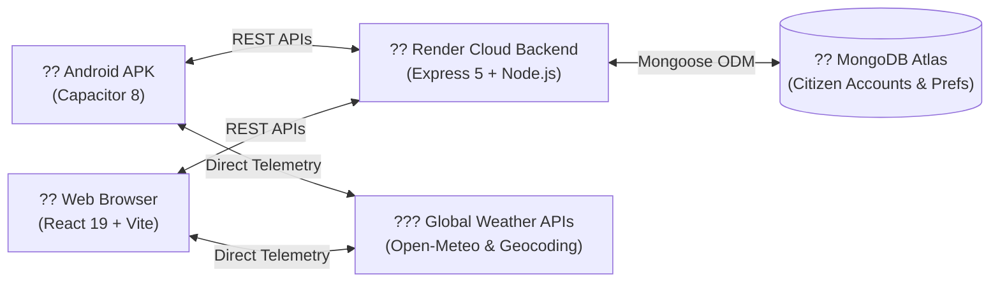

# Mausam (????) — Personalized Weather Intelligence & Android App

[](https://github.com/Mortifer204/mausam_2026/actions/workflows/build-apk.yml)
[](https://mausam-2026.onrender.com/api/health)
[](https://cloud.mongodb.com)
[](https://vitejs.dev)
[-3DDC84?logo=android)](https://github.com/Mortifer204/mausam_2026/actions/runs/33946433314)

**Mausam (????)** is a next-generation, personalized weather intelligence platform and installable Android mobile application. Instead of presenting generic temperature readouts, Mausam analyzes live atmospheric, air quality, and marine data through the lens of citizen lifestyles — providing actionable advisory for **farmers, commuters, outdoor athletes, travelers, and health-sensitive citizens**.

---

## ?? Key Highlights & Capabilities

- ?? **Hardware-Accelerated WebGL Atmosphere:** Real-time atmospheric fragment shaders compute dynamic time-of-day sky gradients, procedural cloud layers, and wind-driven rain/snow simulations directly on the GPU.
- ?? **Persona-Driven Intelligence Engine:** Dynamic scoring engine tailors recommendations to 5 distinct citizen profiles:
  - **Health & Respiratory:** US & European AQI, PM2.5 / PM10 warnings, real-time UV index advisories.
  - **Farmers & Agro-Sector:** Soil moisture, spray window advisories, heavy rain and hail warnings.
  - **Outdoor Athletes & Runners:** Optimal workout windows, thermal comfort index, heat exhaustion risk.
  - **Daily Commuters:** Morning/evening fog visibility forecasts, rain delays, driving hazards.
  - **Travelers:** Packing suggestions, precipitation probability, coastal marine wave conditions.
- ?? **Multi-Source Geolocation & Telemetry:** Seamless automatic GPS device pinpointing with instant fallback to IP geolocation and global city search. Telemetry is sourced directly from Open-Meteo Weather, Air Quality, and Marine models with zero paid API keys required.
- ?? **Cloud Sync with MongoDB Atlas:** Citizen accounts, pinned dashboard widgets, questionnaire answers, and favorite location bookmarks sync seamlessly between web and mobile devices.
- ?? **Native Android APK:** Packaged with Capacitor 8 and compiled via an automated GitHub Actions CI/CD cloud pipeline.

---

## ??? System Architecture at a Glance



> 📚 **Looking for full system architecture, schemas, and presentation guides?**  
> - 🏛️ **[Complete Technical Architecture Guide (PROJECT_ARCHITECTURE.md)](./PROJECT_ARCHITECTURE.md)** — End-to-end breakdown of React 19 frontend, WebGL shaders, scoring engine, Express 5 backend, and Atlas schemas.
> - 🎤 **[Team Presentation & Jury Defense Guide (PRESENTATION_GUIDE.md)](./PRESENTATION_GUIDE.md)** — Elevator pitch, speaking script, demo click-through, and winning answers for jury questions.

---

## ?? Quick Start & Local Setup

### Prerequisites
- [Node.js](https://nodejs.org/) (v20 or higher recommended)
- [MongoDB Atlas](https://cloud.mongodb.com/) cluster URI or local MongoDB instance

### 1. Clone the Repository
```bash
git clone https://github.com/Mortifer204/mausam_2026.git
cd mausam_2026
git checkout dev
```

### 2. Install Dependencies
```bash
npm install
```

### 3. Configure Environment Variables
Create a `.env` file in the root directory:
```env
PORT=5000
MONGO_URI=mongodb+srv://<username>:<password>@cluster.mongodb.net/mausam_db?retryWrites=true&w=majority
JWT_SECRET=your_jwt_secret_key_here
```

### 4. Run Locally (Full Stack)
Run both backend Express server and Vite frontend concurrently with one command:
```bash
npm run dev
```
- **Frontend:** `http://localhost:5173` (with live Hot Module Replacement)
- **Backend API:** `http://localhost:5000` (proxied automatically by Vite)
- **Health Check:** `http://localhost:5000/api/health`

---

## ?? Android APK Download & Compilation

### Download the Compiled APK
The Android APK is compiled automatically in the cloud via GitHub Actions:
?? **[Download Mausam Debug APK (GitHub Actions Run)](https://github.com/Mortifer204/mausam_2026/actions/runs/33946433314)**

### Compiling Locally
To build the Android project locally:
```bash
# 1. Build production web bundle
npm run build

# 2. Sync web assets into Android project
npm run cap copy android

# 3. Open in Android Studio or compile with Gradle
cd android
./gradlew assembleDebug
```
The output APK will be generated at `android/app/build/outputs/apk/debug/app-debug.apk`.

---

## ?? Project Structure Overview

```
mausam/
+-- android/             # Native Android project with Capacitor 8 bridge
+-- server/              # Express 5 REST API & MongoDB Atlas models
¦   +-- models/          # User.js & UserPreferences.js Mongoose schemas
¦   +-- routes/          # authRoutes.js & userRoutes.js
¦   +-- db.js            # MongoDB Atlas connection manager
¦   +-- server.js        # Server entry point & health check
+-- src/                 # React 19 Frontend application
¦   +-- components/      # UI components (Hero, Canvas, Modals, Widgets)
¦   +-- context/         # Auth, Weather, and Personalization state managers
¦   +-- services/        # liveWeatherService.js (Open-Meteo & Geocoding)
¦   +-- utils/           # widgetScoringEngine.js & weatherThemes.js
¦   +-- screens/         # Home, Explore, Alerts, Saved, and Profile views
+-- .github/workflows/   # CI/CD automated Android APK build pipeline
+-- ARCHITECTURE.md      # In-depth architectural & technical documentation
+-- capacitor.config.json# Capacitor mobile runtime configuration
```

---

## ??? License & Acknowledgements
Built for citizen weather empowerment and personalized disaster preparedness.
- Meteorological data provided by [Open-Meteo](https://open-meteo.com/) (CC-BY 4.0).
- Reverse geocoding provided by [BigDataCloud](https://www.bigdatacloud.com/) and [GeoJS](https://get.geojs.io/).

